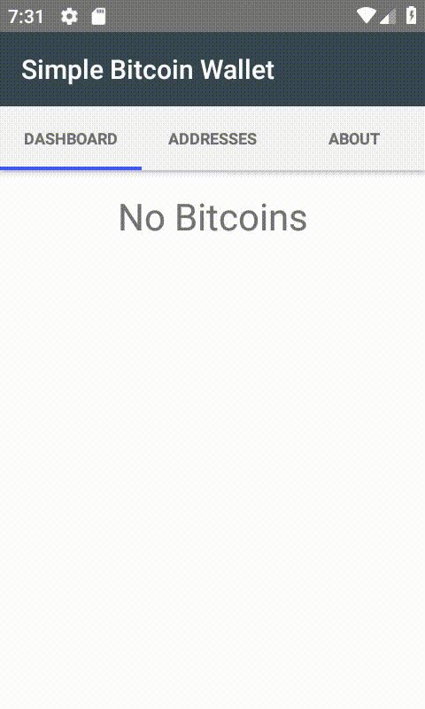

## NS Simple BTC Wallet
* The fastest way to launch: 
  -> download 
    -> connect your device 
      -> open with NativeScript SideKick 
        -> use Cloud build
* This app was built during the live code session at the Angular Warsaw #21 meeting.
* Go to Google Play and install the app: <a href="https://play.google.com/store/apps/details?id=org.nativescript.simplebtcwallet" target="_blank">NS Simple BTC Wallet</a>

